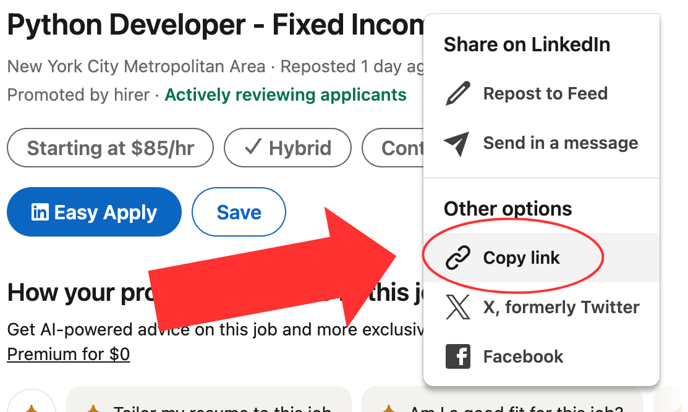
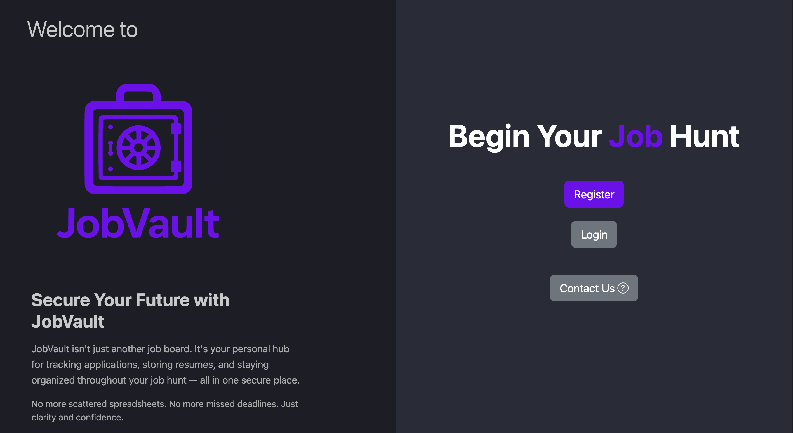
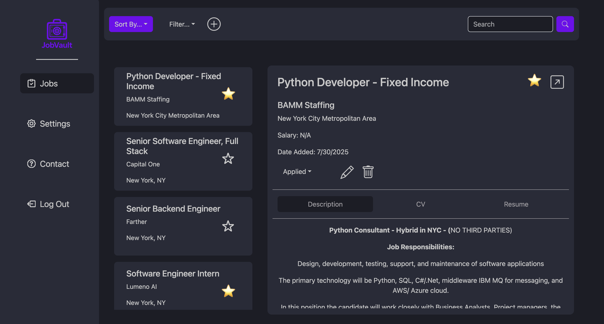
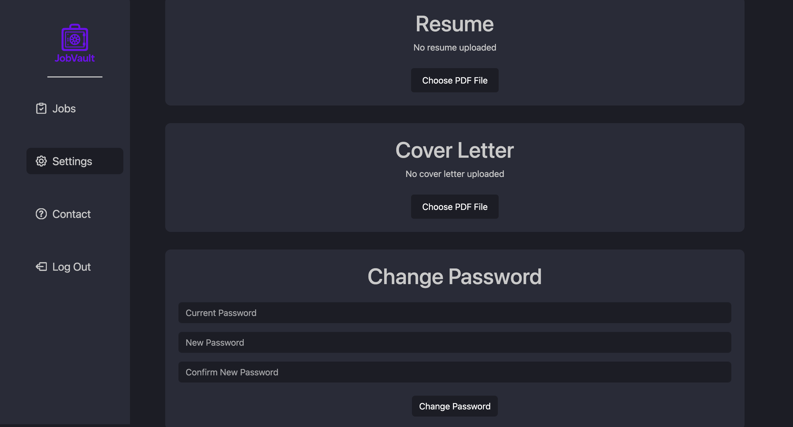

# 📋 JobVault

> A comprehensive web application to streamline your job search with intelligent application tracking and AI-powered resume feedback.

## ✨ Features

- **Job Application Tracking** - Organize and monitor all your job applications in one place
- **LinkedIn Integration** - Easily import job postings directly from LinkedIn
- **AI Resume Feedback** - Get tailored suggestions to improve your resume/CV
- **Email Verification** - Secure account management with email confirmation
- **Custom Applications** - Add your own job applications manually

## 🛠️ Tech Stack

| Component | Technology |
|-----------|------------|
| **Backend** | Java 17, Spring Boot, Maven |
| **Frontend** | TypeScript, React + Vite, npm |

## 🚀 Quick Start

### Prerequisites

Ensure you have the following installed:
- ☕ Java 17 or higher
- 📦 Maven
- 🟢 Node.js and npm

### 🔧 Backend Setup

1. **Navigate to project root**
   ```bash
   cd JobVault
   ```

2. **Build the project**
   ```bash
   mvn clean install
   ```

3. **Start the Spring Boot server**
   ```bash
   mvn spring-boot:run
   ```

### 🎨 Frontend Setup

1. **Navigate to frontend directory**
   ```bash
   cd frontend/JobVaultFrontend
   ```

2. **Install dependencies**
   ```bash
   npm install
   ```

3. **Start the development server**
   ```bash
   npm start
   ```

## 🌐 Getting Started

1. **Access the application** at `http://localhost:5173`
2. **Create an account** and verify your email
3. **Login** to your dashboard
4. **Add job applications** via LinkedIn import or manual entry

### 💡 LinkedIn Integration Tip

When importing from LinkedIn, copy the job URL from the **"Share on LinkedIn"** button, not the browser address bar.



## 📸 Screenshots

<div align="center">

### 👋 Welcome Page


### 📊 Jobs Dashboard


### ⚙️ Settings Panel


</div>

## ❓ Have Questions?

Need help getting started or have feedback? We'd love to hear from you!

**[📧 Contact Us](https://job-vault-livid.vercel.app/contact)**


